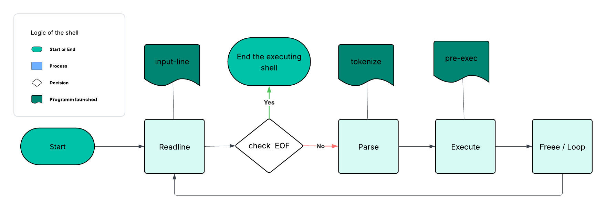

## ***holbertonschool-simple_shell 🐚***

## Description

```c
A shell is a programm that interprets input, and sends them to the operating system for execution.
This program also checks that the inputs are valid.
```

## Compilation

```c
gcc -Wall -Werror -Wextra -pedantic -std=gnu89 *.c -o hsh
```

## Logic of the simple shell



### Dependencies

* ISO C89
* ANSI C
* **librairy** : unistd.h / stdlib.h / stdio.h / string.h / sys/wait.h / sys/types.h

# example of shell:
```c
 $ Hello World
```

```c
$ ls
AUTHORS.md  README.md  check_then_exec_builtin.c  env.c  exec.c  free.c  hsh  img  main.c  man_1_simple_shell  read_line.c  shell-interactive.c  shell-non-interactive.c  shell.h  string.c  tokenize.c
```


# Flow chart


## List of functions and system calls.

* ```_exit``` (man 3 exit)
* ```execve``` (man 2 execve)
* ```fork``` (man 2 fork)
* ```free``` (man 3 free)
* ```getline``` (man 3 getline)
* ```malloc``` (man 3 malloc)
* ```perror``` (man 3 perror)
* ```strtok``` (man 3 strtok)
* ```waitpid``` (man 2 waitpid)
* ```wait``` (man 2 wait)
## Help

Any advise for common problems or issues.

```c
$ man ./man_1_simple_shell 
```

## Authors

Contributors names and contact info

name : Elliot CHARLET / Ilan DEVERSENNE /Robin BOUVIER
e-mail : _charlet.elliot@gmail.com_ / _ilan.deversenne@holbertonstudents.com_ / 12229@holbertonstudents.com

## License

This project is licensed under the [ELLIOT CHARLET and ILAN DEVERSENNE and ROBIN BOUVIER] License